```mermaid
graph LR
    E1((User))
    E2((Admin))
    E3[(Cloud)]
    E4[(Crisis Hotline)]

    D1[(D1: User Accounts)]
    D2[(D2: Agreements)]
    D3[(D3: 56-Day Calendar)]
    D4[(D4: Emotion Logs)]
    D5[(D5: Stress Events)]
    D6[(D6: Body Maps)]
    D7[(D7: Breathing)]
    D8[(D8: Game Results)]
    D9[(D9: Mental Musts)]
    D10[(D10: Negative Thoughts)]
    D11[(D11: Mind Court)]
    D12[(D12: Conflict Logs)]
    D13[(D13: Mood Logs)]
    D14[(D14: Roles/Values)]
    D15[(D15: Mindfulness)]
    D16[(D16: Content)]
    D17[(D17: Notifications)]
    D18[(D18: Preferences)]
    D19[(D19: Reports)]
    D20[(D20: Crisis Logs)]
    D21[(D21: Metadata)]
    D22[(D22: Admin Accts)]
    D23[(D23: Admin Roles)]
    D24[(D24: Statistics)]

    subgraph Onboarding["Onboarding & Setup"]
        P1[1.0 Onboarding\n& Agreement]
        P17[17.0 Notification\nManagement]
        P6[6.0 Calendar &\nProgress Tracking]
    end

    subgraph Assessment["Self-Assessment Tools"]
        P2[2.0 Emotion\nTriangle]
        P3[3.0 Stress\nRegistration]
        P4[4.0 Body Tension\nMapping]
        P5[5.0 Breathing\nExercise]
    end

    subgraph CBT["Cognitive Behavioral Tools"]
        P8[8.0 Cognitive\nError Detection]
        P9[9.0 Mental\nMusts]
        P10[10.0 Negative\nThought Reg]
        P11[11.0 Mind\nCourt]
    end

    subgraph Behavioral["Behavioral Activation"]
        P12[12.0 Conflict\nScenarios]
        P13[13.0 Mood &\nActivity Track]
        P14[14.0 Role-Value\nBalance]
        P15[15.0 Mindfulness\nTechniques]
    end

    subgraph Support["System Services"]
        P7[7.0 Educational\nContent]
        P16[16.0 Data\nPersistence]
        P18[18.0 Crisis\nDetection]
    end

    subgraph AdminPanel["Admin Panel"]
        P19[19.0 Admin\nAuthentication]
        P19_1[19.1 Admin\nDashboard]
        P19_2[19.2 Admin\nReporting]
        P19_3[19.3 User\nManagement]
        P19_4[19.4 Role\nManagement]
    end

    E1 -->|L1: Credentials &\nAgreement Accept| P1
    E1 -->|L2: Touch Triangle\nSides| P2
    E1 -->|L3: Work Situation &\nIntensity 1-10| P3
    E1 -->|L4: Body Region &\nTension Color| P4
    E1 -->|L5: Start/Stop\nBreathing| P5
    E1 -->|L6: View Progress\n& History| P6
    E1 -->|L7: Browse\nContent| P7
    E1 -->|L8: Drag & Drop\nScenarios| P8
    E1 -->|L9: Write Mental\nMusts| P9
    E1 -->|L10: Situation, Thought\n& Error Type| P10
    E1 -->|L11: Supporting &\nContradicting Evidence| P11
    E1 -->|L12: Practice\nConflict| P12
    E1 -->|L13: Mood Before\n& After Activity| P13
    E1 -->|L14: Define Roles\n& Values| P14
    E1 -->|L15: Sky Thoughts,\nTimer, Video| P15
    E1 -->|L16: Toggle\nCloud Sync| P16
    E1 -->|L17: Notification\nPrefs & DND| P17

    E2 -->|L18a: Login\nCredentials| P19
    E2 -->|L18b: Dashboard\nFilters| P19_1
    E2 -->|L18c: Report\nParameters| P19_2
    E2 -->|L18d: User Search\n& Actions| P19_3
    E2 -->|L18e: Role Create\n& Assign| P19_4

    P1 --> D1
    P1 --> D2
    P1 --> D3
    P2 --> D4
    P3 --> D5
    P4 --> D6
    P5 --> D7
    P5 --> D3
    P6 --> D3
    P6 --> D19
    P7 --> D16
    P8 --> D8
    P9 --> D9
    P10 --> D10
    P10 --> D3
    P11 --> D11
    P11 --> D10
    P12 --> D12
    P13 --> D13
    P14 --> D14
    P15 --> D15
    P15 --> D3
    P16 --> D16
    P16 <--> D21
    P17 --> D17
    P17 --> D18
    P18 --> D20
    P18 --> D10
    P19 --> D22
    P19 --> D23
    P19_1 --> D1
    P19_1 --> D19
    P19_1 --> D20
    P19_1 --> D24
    P19_2 --> D19
    P19_2 --> D24
    P19_3 --> D1
    P19_4 --> D23
    P19 -->|L19: Auth\nToken| P19_1
    P19 -->|L19: Auth\nToken| P19_2
    P19 -->|L19: Auth\nToken| P19_3
    P19 -->|L19: Auth\nToken| P19_4

    P16 <--> E3
    P18 <--> E4

    P1 -->|Welcome Screen,\nRoadmap Infographic| E1
    P2 -->|Vibration, Thought\nAccounts| E1
    P3 -->|Confirmation\n| E1
    P4 -->|Anatomical Figure\nColor Gradient| E1
    P5 -->|Breathing Circle\nAnimation| E1
    P6 -->|Weekly Pie Chart\nProgress %| E1
    P7 -->|Concrete Column vs\nPalm Tree, Isolation\nCycle, Quick Register| E1
    P8 -->|Game Feedback\n& Score| E1
    P9 -->|Backpack Image\nwith Stones| E1
    P10 -->|Termite Animation\nIncident Report UI| E1
    P11 -->|Scale Model,\nAlternative Thought,\nDigital Guide| E1
    P12 -->|Scenario\nFeedback| E1
    P13 -->|Activity Impact\nChart| E1
    P14 -->|Overlapping\nCircles| E1
    P15 -->|Cloud Animation,\nSwipe Message,\nTimer Vibration| E1
    P16 -->|Sync Status\n& Warning| E1
    P17 -->|Scheduled\nNotifications| E1
    P18 -->|Crisis Hotline\nNumbers| E1
    P19 -->|Login Response| E2
    P19_1 -->|Dashboard Charts\n& KPIs| E2
    P19_2 -->|Generated\nReports| E2
    P19_3 -->|User List\n& Status| E2
    P19_4 -->|Role List\n& Permissions| E2
```

# DFD Level 1 - Sepur Ravan (Psychological Shield)

## External Entities
| Entity | Description |
|--------|-------------|
| E1 | User (کاربر) |
| E2 | Admin (مدیر سیستم) |
| E3 | Cloud Storage (فضای ابری) |
| E4 | Crisis Hotline DB (پایگاه داده خطوط بحران) |

## Data Stores
| Store | Description |
|-------|-------------|
| D1 | User Accounts |
| D2 | Digital Agreements |
| D3 | 56-Day Calendar |
| D4 | Emotion Interactions |
| D5 | Stress Events |
| D6 | Body Tension Maps |
| D7 | Breathing Sessions |
| D8 | Cognitive Game Results |
| D9 | Mental Musts |
| D10 | Negative Thoughts |
| D11 | Mind Court Records |
| D12 | Conflict Exercises |
| D13 | Mood & Activity Logs |
| D14 | Roles & Values |
| D15 | Mindfulness Exercises |
| D16 | Educational Content |
| D17 | Notifications |
| D18 | User Preferences |
| D19 | Weekly Reports |
| D20 | Crisis Logs |
| D21 | App Metadata |
| D22 | Admin Accounts |
| D23 | Admin Roles |
| D24 | Anonymized Statistics |

## Processes
| Process | Description |
|---------|-------------|
| 1.0 | Onboarding & Agreement |
| 2.0 | Emotion Triangle Interaction |
| 3.0 | Stress Event Registration |
| 4.0 | Body Tension Mapping |
| 5.0 | Breathing Exercise |
| 6.0 | Calendar & Progress Tracking |
| 7.0 | Educational Content Delivery |
| 8.0 | Cognitive Error Detection |
| 9.0 | Mental Musts Management |
| 10.0 | Negative Thought Registration |
| 11.0 | Mind Court (CBT Restructuring) |
| 12.0 | Conflict Scenario Training |
| 13.0 | Mood & Activity Tracking |
| 14.0 | Role-Value Balance |
| 15.0 | Mindfulness Techniques |
| 16.0 | Data Persistence & Sync |
| 17.0 | Notification Management |
| 18.0 | Crisis Detection & Intervention |
| 19.0 | Admin Authentication |
| 19.1 | Admin Dashboard |
| 19.2 | Admin Reporting |
| 19.3 | Admin User Management |
| 19.4 | Admin Role Management |

---

---

## Process Detail

### 1.0 Onboarding & Agreement
- Displays welcome screen on first launch (R18)
- Presents digital agreement for acceptance (R18)
- Shows Sepur Ravan roadmap infographic in week 1 (R19)
- Requests notification and storage permissions (R60)
- Creates user account and initializes 56-day calendar
- Shows last login timestamp (R66)

### 2.0 Emotion Triangle Interaction
- Renders interactive 3-sided triangle: Thought, Body, Behavior (R20)
- Triggers phone vibration when body side is tapped (R21)
- Displays thought accounts when thought side is tapped (R22)

### 3.0 Stress Event Registration
- Quick-register button for situation, thought, and cognitive error type (R23, R36)
- Work stress situations via ready-made buttons (R23)

### 4.0 Body Tension Mapping
- Anatomical figure with touchable body regions (R24, R27)
- Tension intensity via numeric slider 1-10 (R25)
- Color spectrum: yellow (low) to dark red (severe) (R28)

### 5.0 Breathing Exercise
- Breathing circle with inhale/exhale rhythm animation (R29)
- Sends notifications: nervous system recovery, 3-min mindful breathing, mindful walking (R30)
- Auto-ticks daily calendar when audio file or timer completes (R31)

### 6.0 Calendar & Progress Tracking
- Interactive 56-day calendar showing daily entries (R58)
- Weekly progress percentage page (R61)
- Weekly status report as pie chart (R26)
- Ability to review previous weeks content (R59)

### 7.0 Educational Content Delivery
- Concrete column (brittle) vs rebar palm (flexible) comparison with educational message (R32)
- Animated isolation cycle chart: work pressure, reduced activity, reduced mood, more isolation (R45)
- Quick register button for radar of negative thoughts (R36)
- Non-replacement warning: app does not replace psychologist (R55)

### 8.0 Cognitive Error Detection
- 3 scenario-based drag-and-drop game (R33)
- Cognitive error identification in situational contexts

### 9.0 Mental Musts Management
- Backpack image with stones containing mental musts (R34)
- User can write personal mental must (R35)

### 10.0 Negative Thought Registration
- Incident report-style UI for thought entry (R39)
- Impact on performance measured via slider 1-10 (R38)
- Termite animation: negative thoughts destroying psychological structure (R37)

### 11.0 Mind Court (CBT Restructuring)
- Scale model for recording supporting evidence (R40)
- Scale model for recording contradicting evidence, even small (R41)
- Digital guide helper button showing example realities (R42)
- Generates logical, reality-aligned alternative thought as new roadmap (R43)

### 12.0 Conflict Scenario Training
- Workplace conflict simulation scenarios for repeated practice (R44)

### 13.0 Mood & Activity Tracking
- Micro-activity menu: call friend, non-work reading, mindful tea, micro exercise, music (R46)
- Before/after mood measurement proving effect of movement on mood (R47)

### 14.0 Role-Value Balance
- Two overlapping circles: organizational role (job title) and personal values (parent, loving spouse) (R48)

### 15.0 Mindfulness Techniques
- Sky animation: type negative thoughts, become clouds (R49)
- Swipe clouds off screen with message "I am the sky, clouds are passing" (R50)
- Mindful activity timer with periodic gentle vibrations to return to present (R51)
- Comparative video: active acceptance (readiness to respond) vs surrender (passive) (R52)

### 16.0 Data Persistence & Sync
- All user data stored locally on device (R53)
- Optional cloud sync when user enables it (R54)
- No internet required for core content - offline (R65)
- Safe exit: temp data cleared on uninstall (R67)
- Internal storage install, max 150MB (R64)

### 17.0 Notification Management
- Do Not Disturb mode: temporary notification pause (R62)
- Persian language support with readable font and calming UI (R57)

### 18.0 Crisis Detection & Intervention
- Detects suicidal thoughts (R56)
- Displays crisis hotline and psychological aid numbers (R56)

### 19.0 Admin Panel Operations

#### 19.0 Admin Authentication
- Admin login with username/password (R8)
- Role-based access control (R13)
- Session token generation for sub-processes

#### 19.1 Admin Dashboard (R10)
- Real-time monitoring dashboard with KPIs
- Total users, active users, average engagement score
- Crisis alert count and recent activity timeline
- Anonymized data aggregation (D24) for privacy compliance

#### 19.2 Admin Reporting (R11)
- Weekly/monthly report generation from aggregated data
- User engagement trends, stress patterns, completion rates
- Exportable reports for research analysis
- All reports use anonymized statistics - no individual user data exposed

#### 19.3 Admin User Management (R12)
- View user list with status (active/inactive)
- View user progress and engagement metrics
- Manage user accounts (activate/deactivate)
- Search and filter users by registration date, progress, activity

#### 19.4 Admin Role Management (R13)
- Define admin roles (Super Admin, Content Manager, Viewer)
- Assign permissions per role (dashboard, reports, users, content)
- Assign roles to admin users
- Audit role changes via system logs
