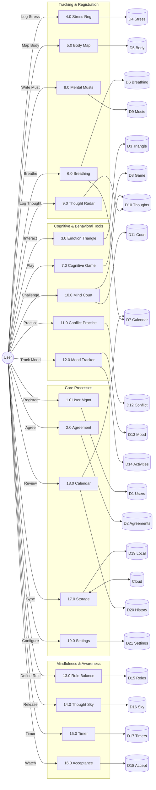

# DFD Level 1 - Complete System View

```mermaid
graph LR
    User((User))

    subgraph Core["Core Processes"]
        P1[1.0 User Mgmt]
        P2[2.0 Agreement]
        P17[17.0 Storage]
        P18[18.0 Calendar]
        P19[19.0 Settings]
    end

    subgraph Tracking["Tracking & Registration"]
        P4[4.0 Stress Reg]
        P5[5.0 Body Map]
        P6[6.0 Breathing]
        P8[8.0 Mental Musts]
        P9[9.0 Thought Radar]
    end

    subgraph CBT["Cognitive & Behavioral Tools"]
        P3[3.0 Emotion Triangle]
        P7[7.0 Cognitive Game]
        P10[10.0 Mind Court]
        P11[11.0 Conflict Practice]
        P12[12.0 Mood Tracker]
    end

    subgraph Mindfulness["Mindfulness & Awareness"]
        P13[13.0 Role Balance]
        P14[14.0 Thought Sky]
        P15[15.0 Timer]
        P16[16.0 Acceptance]
    end

    D1[(D1 Users)]
    D2[(D2 Agreements)]
    D3[(D3 Triangle)]
    D4[(D4 Stress)]
    D5[(D5 Body)]
    D6[(D6 Breathing)]
    D7[(D7 Calendar)]
    D8[(D8 Game)]
    D9[(D9 Musts)]
    D10[(D10 Thoughts)]
    D11[(D11 Court)]
    D12[(D12 Conflict)]
    D13[(D13 Mood)]
    D14[(D14 Activities)]
    D15[(D15 Roles)]
    D16[(D16 Sky)]
    D17[(D17 Timers)]
    D18[(D18 Accept)]
    D19[(D19 Local)]
    D20[(D20 History)]
    D21[(D21 Settings)]
    Cloud[(Cloud)]

    User -->|Register| P1
    User -->|Agree| P2
    User -->|Interact| P3
    User -->|Log Stress| P4
    User -->|Map Body| P5
    User -->|Breathe| P6
    User -->|Play| P7
    User -->|Write Must| P8
    User -->|Log Thought| P9
    User -->|Challenge| P10
    User -->|Practice| P11
    User -->|Track Mood| P12
    User -->|Define Role| P13
    User -->|Release| P14
    User -->|Timer| P15
    User -->|Watch| P16
    User -->|Sync| P17
    User -->|Review| P18
    User -->|Configure| P19

    P1 --> D1
    P2 --> D2
    P3 --> D3
    P4 --> D4
    P5 --> D5
    P6 --> D6
    P6 --> D7
    P7 --> D8
    P8 --> D9
    P9 --> D10
    P10 --> D11
    P10 --> D10
    P11 --> D12
    P12 --> D13
    P12 --> D14
    P13 --> D15
    P14 --> D16
    P15 --> D17
    P16 --> D18
    P17 --> D19
    P17 <--> Cloud
    P18 --> D7
    P18 --> D20
    P19 --> D21
```
