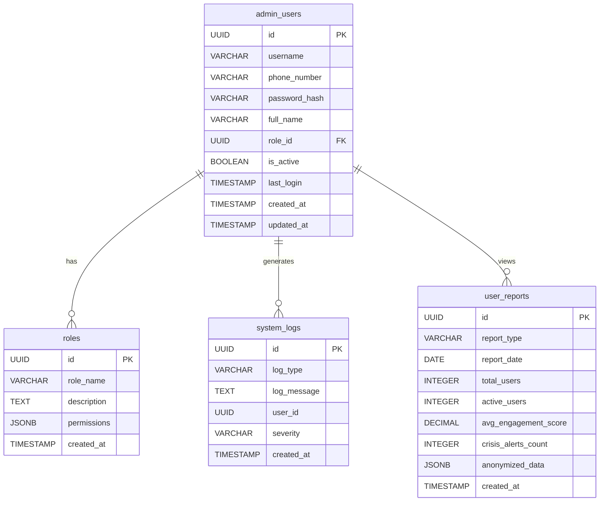

## Main Schema

```mermaid
erDiagram
    users ||--o{ daily_calendar : has
    users ||--o{ emotion_triangle_interactions : logs
    users ||--o{ stress_events : experiences
    users ||--o{ body_tension_maps : creates
    users ||--o{ breathing_sessions : performs
    users ||--o{ cognitive_error_games : plays
    users ||--o{ mental_musts : stores
    users ||--o{ negative_thoughts : records
    users ||--o{ mind_court_evidence : evaluates
    users ||--o{ conflict_exercises : practices
    users ||--o{ mood_tracker : tracks
    users ||--o{ roles_and_values : defines
    users ||--o{ sky_thoughts : releases
    users ||--o{ mindful_timers : uses
    users ||--o{ acceptance_exercises : completes
    users ||--o{ weekly_reports : generates
    
    negative_thoughts ||--o{ mind_court_evidence : challenged_by
    
    users {
        UUID id PK
        VARCHAR phone_number
        TIMESTAMP registration_date
        TIMESTAMP last_login
        INTEGER login_count
        BOOLEAN agreement_accepted
        BOOLEAN cloud_sync_enabled
        BOOLEAN do_not_disturb_enabled
        TIMESTAMP created_at
        TIMESTAMP updated_at
    }
    
    daily_calendar {
        UUID id PK
        UUID user_id FK
        INTEGER day_number
        DATE calendar_date
        BOOLEAN is_completed
        TIMESTAMP completed_at
        JSONB activities_completed
        TIMESTAMP created_at
    }
    
    emotion_triangle_interactions {
        UUID id PK
        UUID user_id FK
        TIMESTAMP interaction_date
        VARCHAR side_clicked
        JSONB thought_accounts_viewed
        BOOLEAN vibration_triggered
        INTEGER day_number
        TIMESTAMP created_at
    }
    
    stress_events {
        UUID id PK
        UUID user_id FK
        TIMESTAMP event_timestamp
        VARCHAR situation_type
        TEXT situation_description
        INTEGER intensity_level
        VARCHAR location
        INTEGER day_number
        TIMESTAMP created_at
    }
    
    body_tension_maps {
        UUID id PK
        UUID user_id FK
        TIMESTAMP mapping_date
        JSONB body_regions
        INTEGER overall_intensity
        VARCHAR severity_color
        TEXT notes
        INTEGER day_number
        TIMESTAMP created_at
    }
    
    breathing_sessions {
        UUID id PK
        UUID user_id FK
        TIMESTAMP session_start
        TIMESTAMP session_end
        INTEGER duration_seconds
        VARCHAR breathing_pattern
        BOOLEAN is_completed
        BOOLEAN calendar_ticked
        INTEGER day_number
        TIMESTAMP created_at
    }
    
    cognitive_error_games {
        UUID id PK
        UUID user_id FK
        TIMESTAMP game_date
        INTEGER scenario_id
        VARCHAR scenario_type
        INTEGER score
        BOOLEAN is_correct
        INTEGER time_taken_seconds
        INTEGER day_number
        TIMESTAMP created_at
    }
    
    mental_musts {
        UUID id PK
        UUID user_id FK
        TEXT must_text
        TIMESTAMP created_date
        BOOLEAN is_released
        TIMESTAMP released_date
        INTEGER day_number
        TIMESTAMP created_at
    }
    
    negative_thoughts {
        UUID id PK
        UUID user_id FK
        TEXT thought_text
        TEXT situation
        VARCHAR cognitive_error_type
        INTEGER impact_level
        TIMESTAMP recorded_at
        INTEGER day_number
        TIMESTAMP created_at
    }
    
    mind_court_evidence {
        UUID id PK
        UUID user_id FK
        UUID negative_thought_id FK
        TEXT supporting_evidence
        TEXT contradicting_evidence
        BOOLEAN guide_helper_used
        TEXT alternative_thought
        TIMESTAMP created_date
        INTEGER day_number
        TIMESTAMP created_at
    }
    
    conflict_exercises {
        UUID id PK
        UUID user_id FK
        INTEGER scenario_id
        INTEGER practice_count
        TIMESTAMP last_practice_date
        INTEGER performance_score
        INTEGER day_number
        TIMESTAMP created_at
        TIMESTAMP updated_at
    }
    
    mood_tracker {
        UUID id PK
        UUID user_id FK
        UUID activity_id
        VARCHAR activity_name
        INTEGER mood_before
        INTEGER mood_after
        TIMESTAMP activity_date
        TEXT notes
        INTEGER day_number
        TIMESTAMP created_at
    }
    
    roles_and_values {
        UUID id PK
        UUID user_id FK
        VARCHAR entry_type
        TEXT entry_text
        TIMESTAMP created_date
        INTEGER day_number
        TIMESTAMP created_at
    }
    
    sky_thoughts {
        UUID id PK
        UUID user_id FK
        TEXT thought_text
        BOOLEAN cloud_swiped
        TIMESTAMP swiped_at
        TIMESTAMP created_date
        INTEGER day_number
        TIMESTAMP created_at
    }
    
    mindful_timers {
        UUID id PK
        UUID user_id FK
        TIMESTAMP timer_start
        TIMESTAMP timer_end
        INTEGER duration_seconds
        INTEGER vibration_reminders_count
        BOOLEAN is_completed
        INTEGER day_number
        TIMESTAMP created_at
    }
    
    acceptance_exercises {
        UUID id PK
        UUID user_id FK
        BOOLEAN video_watched
        TIMESTAMP watched_at
        INTEGER understanding_level
        TEXT notes
        INTEGER day_number
        TIMESTAMP created_at
    }
    
    weekly_reports {
        UUID id PK
        UUID user_id FK
        INTEGER week_number
        DATE start_date
        DATE end_date
        INTEGER stress_events_count
        DECIMAL avg_stress_intensity
        INTEGER breathing_sessions_count
        INTEGER negative_thoughts_count
        INTEGER body_tension_maps_count
        DECIMAL mood_improvement_score
        JSONB activities_distribution
        DECIMAL progress_percentage
        TIMESTAMP generated_at
    }
```

## Admin Schema

## Relationships Summary

| Relationship | Type | Description |
|--------------|------|-------------|
| users → daily_calendar | 1:N | User has 56 calendar entries |
| users → emotion_triangle_interactions | 1:N | User logs multiple interactions |
| users → stress_events | 1:N | User records multiple stress events |
| users → body_tension_maps | 1:N | User creates multiple body maps |
| users → breathing_sessions | 1:N | User performs multiple sessions |
| users → cognitive_error_games | 1:N | User plays multiple games |
| users → mental_musts | 1:N | User stores multiple mental musts |
| users → negative_thoughts | 1:N | User records multiple thoughts |
| negative_thoughts → mind_court_evidence | 1:N | Thought challenged with evidence |
| users → conflict_exercises | 1:N | User practices multiple scenarios |
| users → mood_tracker | 1:N | User tracks mood multiple times |
| users → roles_and_values | 1:N | User defines multiple roles/values |
| users → sky_thoughts | 1:N | User releases multiple thoughts |
| users → mindful_timers | 1:N | User uses multiple timers |
| users → acceptance_exercises | 1:N | User completes multiple exercises |
| users → weekly_reports | 1:N | User generates 8 weekly reports |
| admin_users → roles | N:1 | Admin users have roles |
