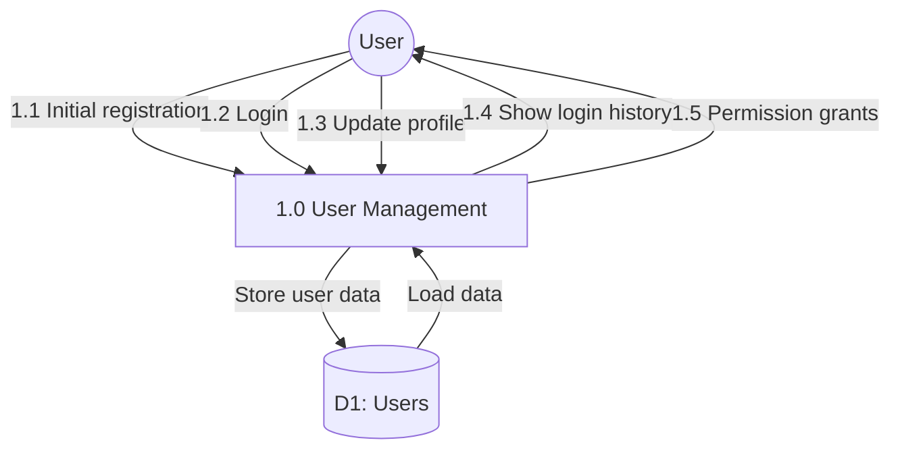

# Process 1.0: User Management & Authentication

## Data Store: D1 Users

| Field | Type | Description |
|-------|------|-------------|
| id | UUID | Primary key |
| phone_number | VARCHAR(20) | Unique phone number |
| registration_date | TIMESTAMP | Registration timestamp |
| last_login | TIMESTAMP | Last login timestamp |
| login_count | INTEGER | Total login count |
| agreement_accepted | BOOLEAN | Digital agreement status |
| cloud_sync_enabled | BOOLEAN | Cloud sync preference |
| do_not_disturb_enabled | BOOLEAN | DND mode status |
| created_at | TIMESTAMP | Creation timestamp |
| updated_at | TIMESTAMP | Last update timestamp |
