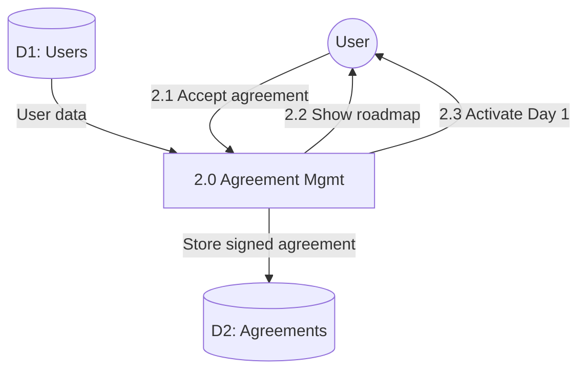

# Process 2.0: Agreement & Program Initiation

## Data Store: D2 Agreements

| Field | Type | Description |
|-------|------|-------------|
| id | UUID | Primary key |
| user_id | UUID | Foreign key to users |
| agreement_text | TEXT | Agreement content |
| accepted | BOOLEAN | Acceptance status |
| accepted_date | TIMESTAMP | Acceptance timestamp |
| created_at | TIMESTAMP | Creation timestamp |
