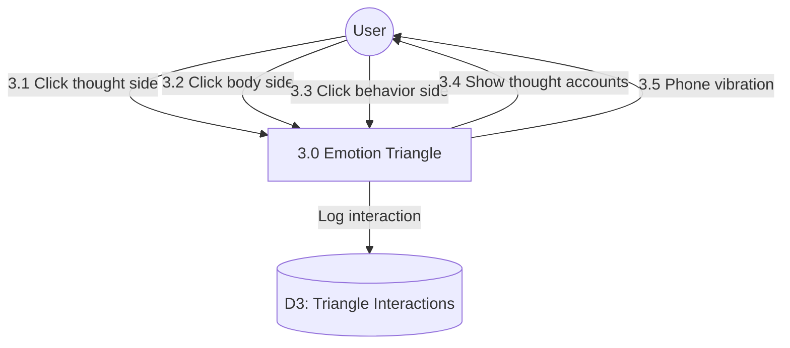

# Process 3.0: Emotion Triangle Interaction

## Data Store: D3 Triangle Interactions

| Field | Type | Description |
|-------|------|-------------|
| id | UUID | Primary key |
| user_id | UUID | Foreign key to users |
| interaction_date | TIMESTAMP | Interaction timestamp |
| side_clicked | VARCHAR(20) | thought/body/behavior |
| thought_accounts_viewed | JSONB | Viewed thought accounts |
| vibration_triggered | BOOLEAN | Vibration activated |
| day_number | INTEGER | Program day (1-56) |
| created_at | TIMESTAMP | Creation timestamp |
