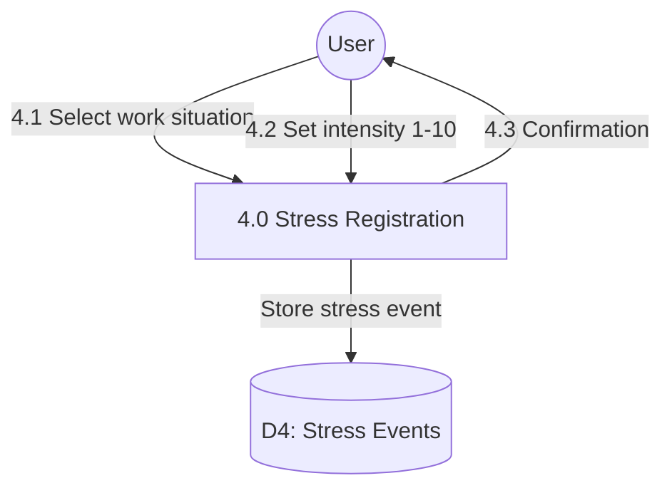

# Process 4.0: Stress Event Registration

## Data Store: D4 Stress Events

| Field | Type | Description |
|-------|------|-------------|
| id | UUID | Primary key |
| user_id | UUID | Foreign key to users |
| event_timestamp | TIMESTAMP | Event timestamp |
| situation_type | VARCHAR(50) | Type of stress situation |
| situation_description | TEXT | Situation description |
| intensity_level | INTEGER | Intensity 1-10 |
| location | VARCHAR(100) | Event location |
| day_number | INTEGER | Program day (1-56) |
| created_at | TIMESTAMP | Creation timestamp |
