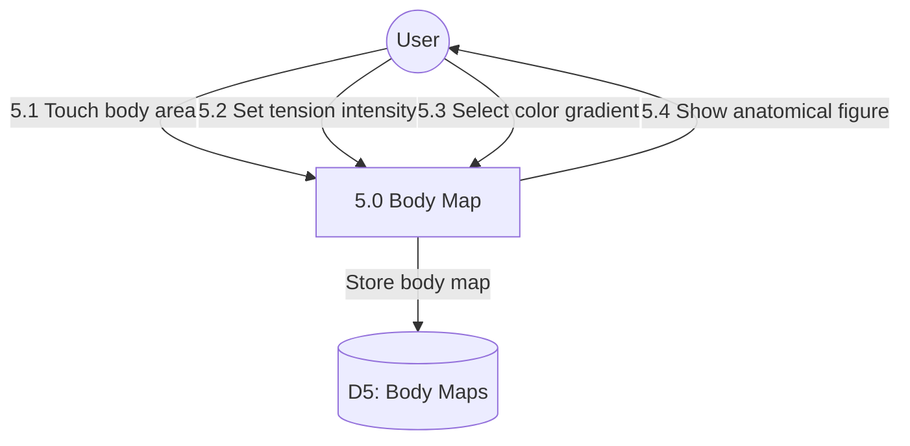

# Process 5.0: Body Map & Physical Tension

## Data Store: D5 Body Maps

| Field | Type | Description |
|-------|------|-------------|
| id | UUID | Primary key |
| user_id | UUID | Foreign key to users |
| mapping_date | TIMESTAMP | Mapping timestamp |
| body_regions | JSONB | Body regions with intensity |
| overall_intensity | INTEGER | Overall intensity 1-10 |
| severity_color | VARCHAR(20) | Yellow to dark red |
| notes | TEXT | Additional notes |
| day_number | INTEGER | Program day (1-56) |
| created_at | TIMESTAMP | Creation timestamp |
