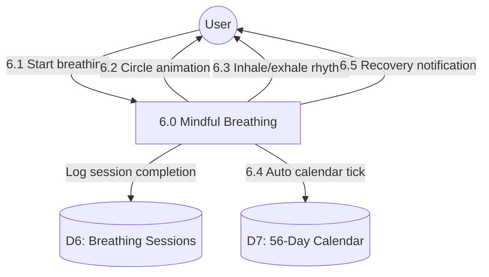

# Process 6.0: Mindful Breathing

## Data Store: D6 Breathing Sessions

| Field | Type | Description |
|-------|------|-------------|
| id | UUID | Primary key |
| user_id | UUID | Foreign key to users |
| session_start | TIMESTAMP | Session start time |
| session_end | TIMESTAMP | Session end time |
| duration_seconds | INTEGER | Session duration |
| breathing_pattern | VARCHAR(50) | Breathing pattern type |
| is_completed | BOOLEAN | Session completed |
| calendar_ticked | BOOLEAN | Calendar auto-ticked |
| day_number | INTEGER | Program day (1-56) |
| created_at | TIMESTAMP | Creation timestamp |

## Data Store: D7 56-Day Calendar

| Field | Type | Description |
|-------|------|-------------|
| id | UUID | Primary key |
| user_id | UUID | Foreign key to users |
| day_number | INTEGER | Day 1-56 |
| calendar_date | DATE | Calendar date |
| is_completed | BOOLEAN | Day completed |
| completed_at | TIMESTAMP | Completion timestamp |
| activities_completed | JSONB | Completed activities array |
| created_at | TIMESTAMP | Creation timestamp |
