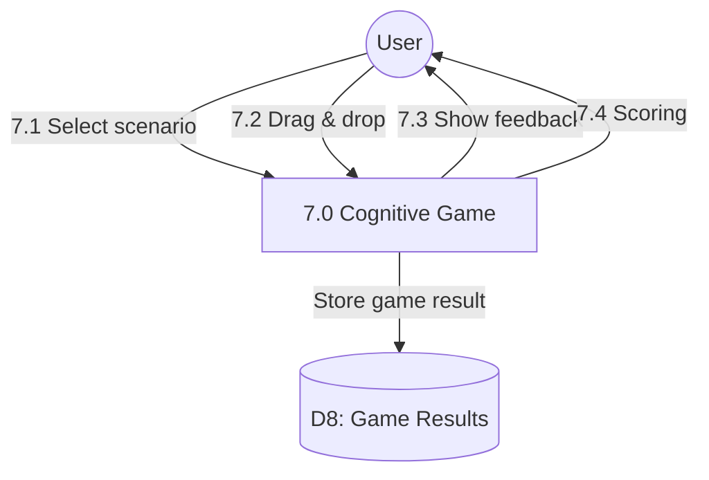

# Process 7.0: Cognitive Error Game

## Data Store: D8 Game Results

| Field | Type | Description |
|-------|------|-------------|
| id | UUID | Primary key |
| user_id | UUID | Foreign key to users |
| game_date | TIMESTAMP | Game timestamp |
| scenario_id | INTEGER | Scenario identifier |
| scenario_type | VARCHAR(50) | Scenario type |
| score | INTEGER | Game score |
| is_correct | BOOLEAN | Correct answer |
| time_taken_seconds | INTEGER | Time to complete |
| day_number | INTEGER | Program day (1-56) |
| created_at | TIMESTAMP | Creation timestamp |
