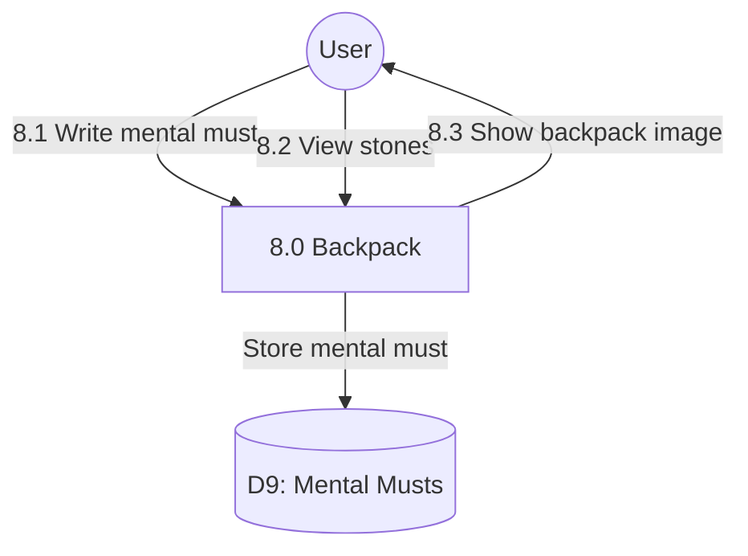

# Process 8.0: Mental Musts Backpack

## Data Store: D9 Mental Musts

| Field | Type | Description |
|-------|------|-------------|
| id | UUID | Primary key |
| user_id | UUID | Foreign key to users |
| must_text | TEXT | Mental must content |
| created_date | TIMESTAMP | Creation timestamp |
| is_released | BOOLEAN | Released status |
| released_date | TIMESTAMP | Release timestamp |
| day_number | INTEGER | Program day (1-56) |
| created_at | TIMESTAMP | Creation timestamp |
