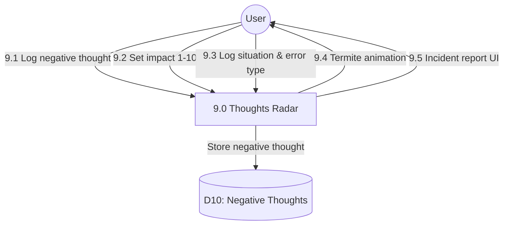

# Process 9.0: Negative Thoughts Radar

## Data Store: D10 Negative Thoughts

| Field | Type | Description |
|-------|------|-------------|
| id | UUID | Primary key |
| user_id | UUID | Foreign key to users |
| thought_text | TEXT | Negative thought content |
| situation | TEXT | Situation context |
| cognitive_error_type | VARCHAR(50) | Error type classification |
| impact_level | INTEGER | Impact 1-10 |
| recorded_at | TIMESTAMP | Recording timestamp |
| day_number | INTEGER | Program day (1-56) |
| created_at | TIMESTAMP | Creation timestamp |
