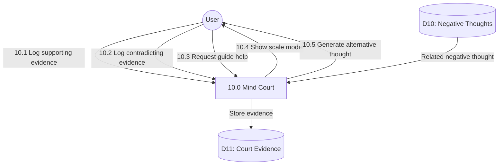

# Process 10.0: Mind Court

## Data Store: D11 Court Evidence

| Field | Type | Description |
|-------|------|-------------|
| id | UUID | Primary key |
| user_id | UUID | Foreign key to users |
| negative_thought_id | UUID | FK to negative_thoughts |
| supporting_evidence | TEXT | Supporting evidence |
| contradicting_evidence | TEXT | Contradicting evidence |
| guide_helper_used | BOOLEAN | Guide helper activated |
| alternative_thought | TEXT | Generated alternative |
| created_date | TIMESTAMP | Creation timestamp |
| day_number | INTEGER | Program day (1-56) |
| created_at | TIMESTAMP | Creation timestamp |
