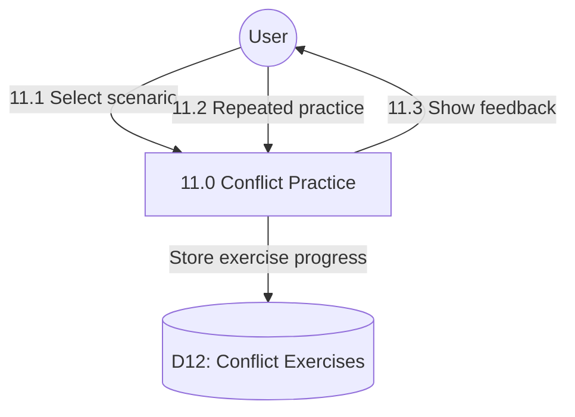

# Process 11.0: Work Conflict Scenarios

## Data Store: D12 Conflict Exercises

| Field | Type | Description |
|-------|------|-------------|
| id | UUID | Primary key |
| user_id | UUID | Foreign key to users |
| scenario_id | INTEGER | Scenario identifier |
| practice_count | INTEGER | Number of practices |
| last_practice_date | TIMESTAMP | Last practice timestamp |
| performance_score | INTEGER | Performance score |
| day_number | INTEGER | Program day (1-56) |
| created_at | TIMESTAMP | Creation timestamp |
| updated_at | TIMESTAMP | Last update timestamp |
