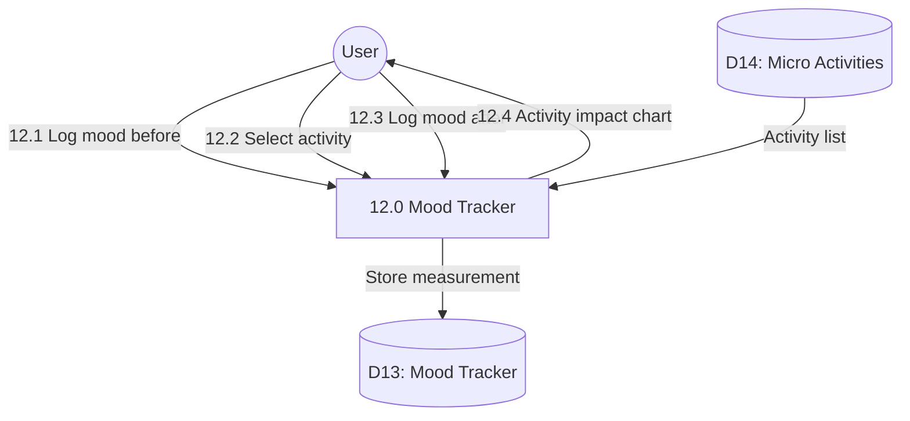

# Process 12.0: Mood & Activity Tracker

## Data Store: D13 Mood Tracker

| Field | Type | Description |
|-------|------|-------------|
| id | UUID | Primary key |
| user_id | UUID | Foreign key to users |
| activity_id | UUID | Activity identifier |
| activity_name | VARCHAR(100) | Activity name |
| mood_before | INTEGER | Mood before 1-10 |
| mood_after | INTEGER | Mood after 1-10 |
| activity_date | TIMESTAMP | Activity timestamp |
| notes | TEXT | Additional notes |
| day_number | INTEGER | Program day (1-56) |
| created_at | TIMESTAMP | Creation timestamp |

## Data Store: D14 Micro Activities

| Field | Type | Description |
|-------|------|-------------|
| id | UUID | Primary key |
| activity_name | VARCHAR(100) | Activity name |
| activity_type | VARCHAR(50) | Activity category |
| description | TEXT | Activity description |
| is_active | BOOLEAN | Active status |
