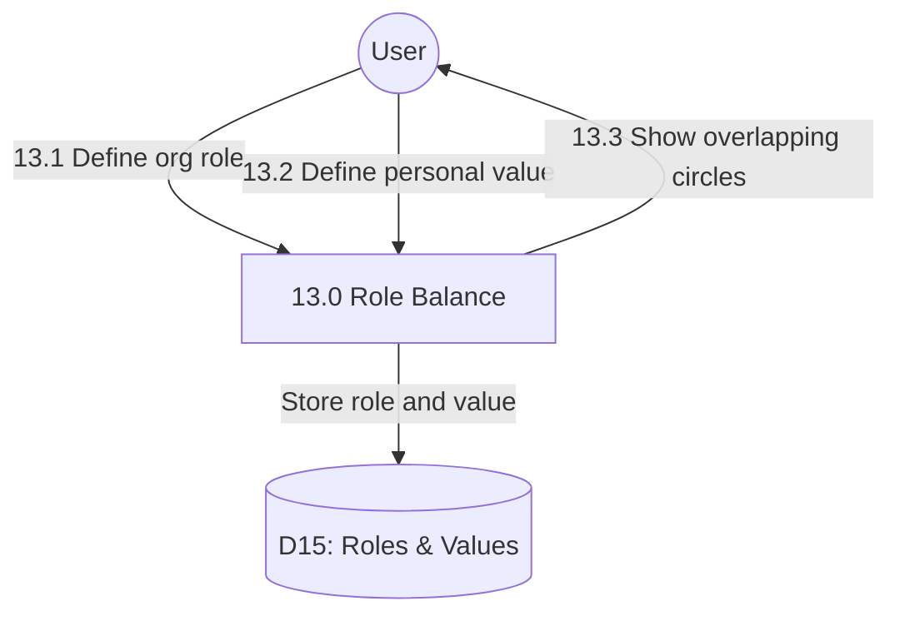

# Process 13.0: Role & Values Balance

## Data Store: D15 Roles & Values

| Field | Type | Description |
|-------|------|-------------|
| id | UUID | Primary key |
| user_id | UUID | Foreign key to users |
| entry_type | VARCHAR(20) | role or value |
| entry_text | TEXT | Entry content |
| created_date | TIMESTAMP | Creation timestamp |
| day_number | INTEGER | Program day (1-56) |
| created_at | TIMESTAMP | Creation timestamp |
