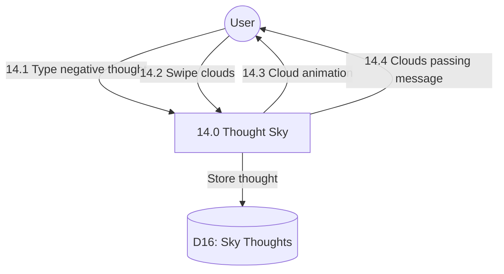

# Process 14.0: Thought Sky

## Data Store: D16 Sky Thoughts

| Field | Type | Description |
|-------|------|-------------|
| id | UUID | Primary key |
| user_id | UUID | Foreign key to users |
| thought_text | TEXT | Thought content |
| cloud_swiped | BOOLEAN | Cloud swiped status |
| swiped_at | TIMESTAMP | Swipe timestamp |
| created_date | TIMESTAMP | Creation timestamp |
| day_number | INTEGER | Program day (1-56) |
| created_at | TIMESTAMP | Creation timestamp |
