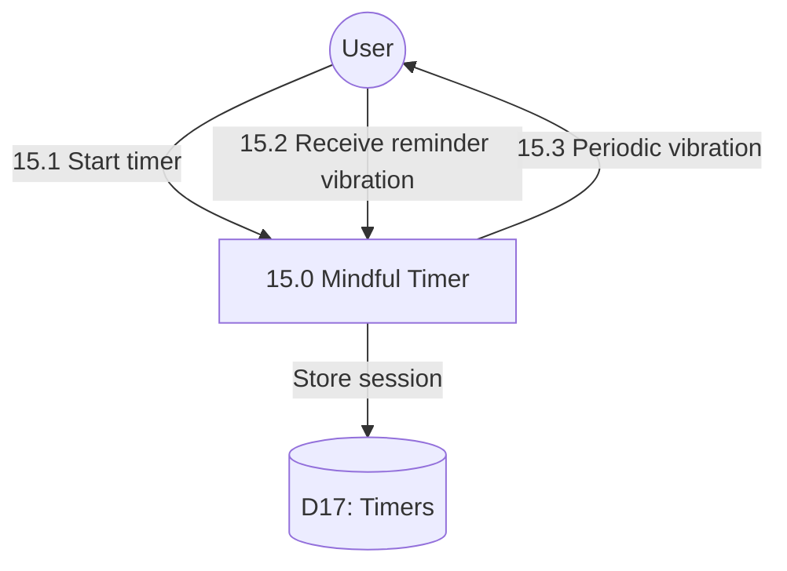

# Process 15.0: Mindful Activity Timer

## Data Store: D17 Timers

| Field | Type | Description |
|-------|------|-------------|
| id | UUID | Primary key |
| user_id | UUID | Foreign key to users |
| timer_start | TIMESTAMP | Timer start time |
| timer_end | TIMESTAMP | Timer end time |
| duration_seconds | INTEGER | Timer duration |
| vibration_reminders_count | INTEGER | Vibration count |
| is_completed | BOOLEAN | Completion status |
| day_number | INTEGER | Program day (1-56) |
| created_at | TIMESTAMP | Creation timestamp |
