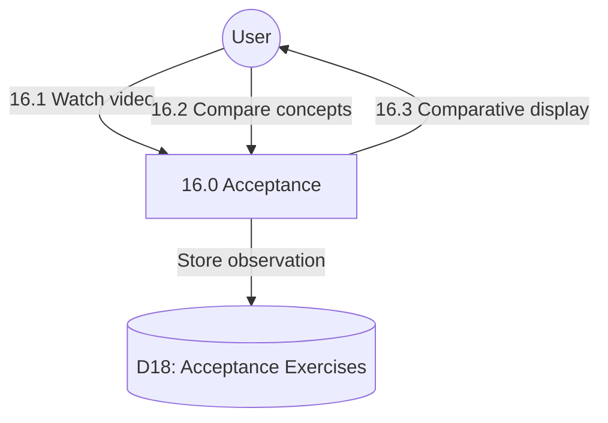

# Process 16.0: Active Acceptance vs Surrender

## Data Store: D18 Acceptance Exercises

| Field | Type | Description |
|-------|------|-------------|
| id | UUID | Primary key |
| user_id | UUID | Foreign key to users |
| video_watched | BOOLEAN | Video watched status |
| watched_at | TIMESTAMP | Watch timestamp |
| understanding_level | INTEGER | Understanding 1-10 |
| notes | TEXT | User notes |
| day_number | INTEGER | Program day (1-56) |
| created_at | TIMESTAMP | Creation timestamp |
