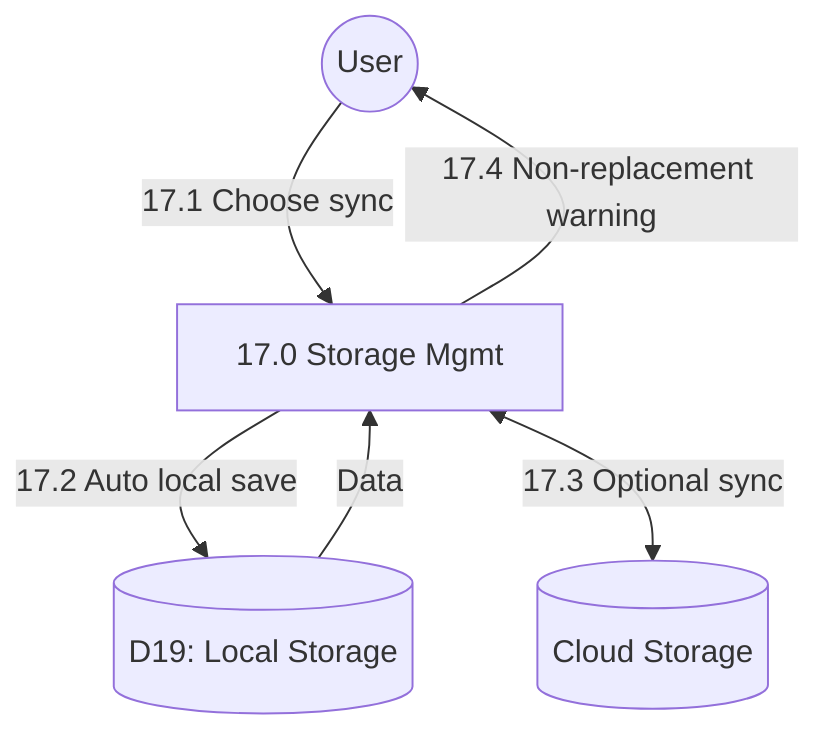

# Process 17.0: Local Storage & Sync

## Data Store: D19 Local Storage

Local SQLite database containing all application tables with sync status fields:

| Field | Type | Description |
|-------|------|-------------|
| sync_status | VARCHAR(20) | pending/synced/conflict |
| last_synced_at | TIMESTAMP | Last sync timestamp |
| device_id | VARCHAR(100) | Device identifier |
| storage_used_mb | INTEGER | Storage usage |
