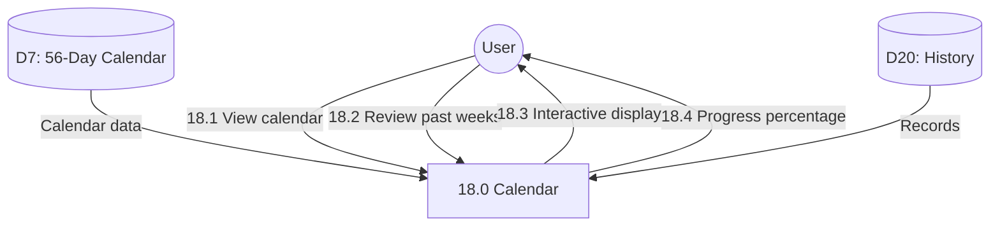

# Process 18.0: Calendar & History

## Data Store: D7 56-Day Calendar

| Field | Type | Description |
|-------|------|-------------|
| id | UUID | Primary key |
| user_id | UUID | Foreign key to users |
| day_number | INTEGER | Day 1-56 |
| calendar_date | DATE | Calendar date |
| is_completed | BOOLEAN | Day completed |
| completed_at | TIMESTAMP | Completion timestamp |
| activities_completed | JSONB | Completed activities |
| created_at | TIMESTAMP | Creation timestamp |

## Data Store: D20 History

Historical records aggregation table:

| Field | Type | Description |
|-------|------|-------------|
| id | UUID | Primary key |
| user_id | UUID | Foreign key to users |
| record_type | VARCHAR(50) | Type of record |
| record_data | JSONB | Record content |
| record_date | TIMESTAMP | Record timestamp |
| week_number | INTEGER | Week 1-8 |
| day_number | INTEGER | Day 1-56 |
| created_at | TIMESTAMP | Creation timestamp |
