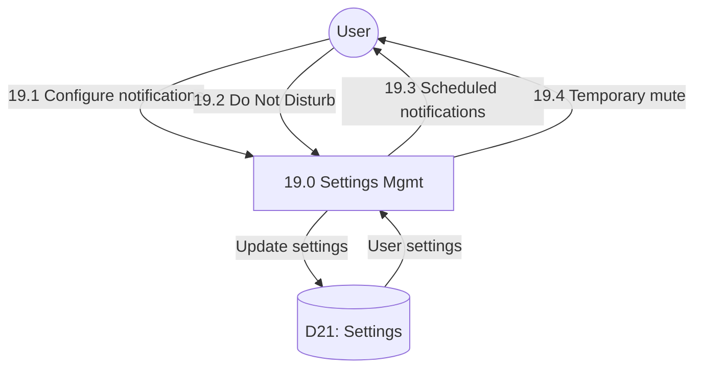

# Process 19.0: Notification & Settings Management

## Data Store: D21 Settings

| Field | Type | Description |
|-------|------|-------------|
| id | UUID | Primary key |
| user_id | UUID | Foreign key to users (unique) |
| notification_enabled | BOOLEAN | Notifications on/off |
| vibration_enabled | BOOLEAN | Vibration on/off |
| language | VARCHAR(5) | Language code |
| font_size | VARCHAR(10) | Font size setting |
| theme | VARCHAR(20) | UI theme |
| crisis_alert_threshold | INTEGER | Alert threshold 1-10 |
| created_at | TIMESTAMP | Creation timestamp |
| updated_at | TIMESTAMP | Last update timestamp |
